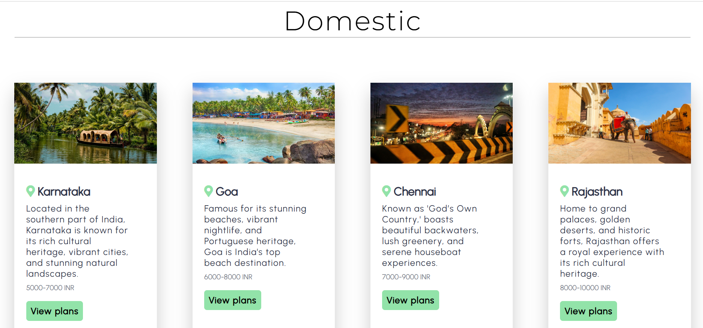
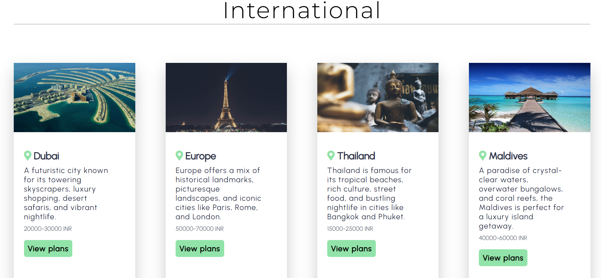
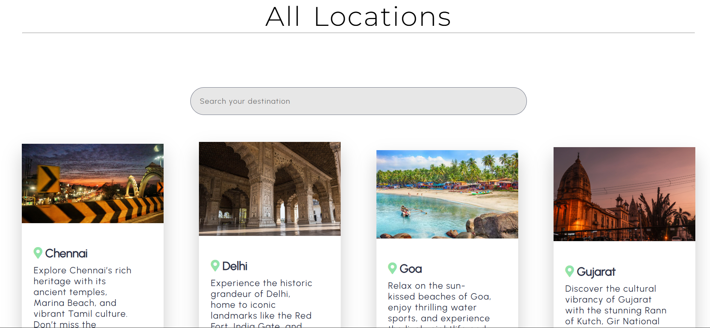
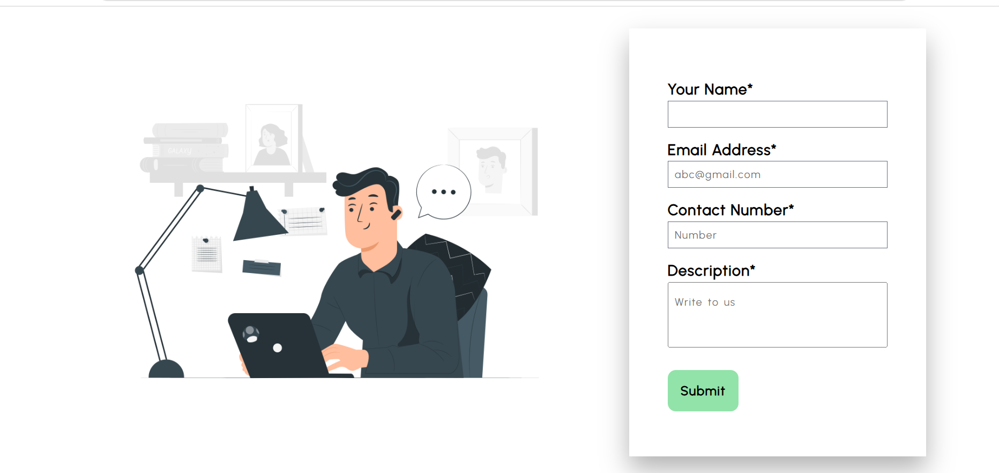

# ✈️ TripMania — Travel Discovery App

A modern travel discovery interface built with React.js featuring component-based architecture, client-side routing, reusable UI sections, and fully responsive layouts across all devices.


## 🔗 Live Demo
[View Live Site](https://trip-mania-pratham-s.vercel.app/)

## 🛠️ Built With

- React.js
- HTML5
- CSS3
- JavaScript (ES6+)
- React Router (client-side routing)
- Vercel (deployment)

## ✨ Features

- Component-based architecture with reusable UI sections
- Client-side routing between pages — no full page reloads
- Fully responsive design across mobile, tablet and desktop
- Home page with hero section and featured destinations
- Domestic travel listings
- International travel listings
- Locations discovery section
- Book section for travel planning
- Contact section for enquiries
- Clean and modern travel-themed UI

## 📸 Screenshots

### Home Page


### Bookings Page


### Domestic Section


### International Section


### Locations Section


### Contact Section



## 🚀 Getting Started

### Prerequisites
- Node.js installed
- npm or yarn

### Installation

1. Clone the repo
```bash
git clone https://github.com/pratham-amin/TripMania.git
```

2. Navigate to the project folder
```bash
cd TripMania
```

3. Install dependencies
```bash
npm install
```

4. Start the development server
```bash
npm start
```

5. Open your browser and visit